# Parcours de l'atelier

Le [README](README.md) dit **ce que fait** chaque fonction, module par module. Ce document dit
**dans quel ordre elles s'appellent** : qui déclenche quoi, quand on clique, et ce que le geste
coûte.

Les deux se complètent sans se recopier. Le rôle d'une fonction ne se lit qu'au README ; le chemin
d'un geste ne se lit qu'ici. Les diagrammes ne nomment donc que les fonctions qui font avancer le
parcours — le reste est dans les tableaux du README, où chaque module a sa section.

Pourquoi un tel document : l'application n'a ni framework, ni modules, ni build. Quinze scripts
partagent une portée globale, un unique écouteur de clic délégué aiguille tous les gestes, et
l'état tient dans un seul objet. Rien, dans cette forme, ne rend un chemin d'exécution visible ; il
faut le reconstituer à la lecture. C'est ce travail-là, fait une fois.

---

## 1. Les modules

Dans l'ordre où `index.html` les charge — l'ordre compte, `effets.js` définissant l'analyseur dont
`cartes.js` se sert pour bâtir la base livrée.

| Module | Rôle | Fonctions | Taille |
|---|---|---|---|
| [`js/effets.js`](README.md#jseffetsjs--lecture-des-effets-des-cartes) | Lecture des effets des cartes | 14 | 28 Ko |
| [`js/cartes.js`](README.md#jscartesjs--base-de-cartes) | Base de cartes | 28 | 47 Ko |
| [`js/etat.js`](README.md#jsetatjs--état-et-filtrage) | État et filtrage | 41 | 24 Ko |
| [`js/groupes.js`](README.md#jsgroupesjs--grouper-et-trier-les-listes) | Grouper et trier les listes | 12 | 14 Ko |
| [`js/marche.js`](README.md#jsmarchejs--cardmarket) | Cardmarket | 5 | 2 Ko |
| [`js/scryfall.js`](README.md#jsscryfalljs--accès-à-scryfall) | Accès à Scryfall | 25 | 24 Ko |
| [`js/stockage.js`](README.md#jsstockagejs--sauvegarde-locale) | Sauvegarde locale | 14 | 20 Ko |
| [`js/externes.js`](README.md#jsexternesjs--edhrec-et-commander-spellbook) | EDHREC et Commander Spellbook | 80 | 64 Ko |
| [`js/graphe.js`](README.md#jsgraphejs--graphe-des-capacités) | Graphe des capacités | 4 | 9 Ko |
| [`js/stats.js`](README.md#jsstatsjs--statistiques) | Statistiques | 3 | 5 Ko |
| [`js/suggestions.js`](README.md#jssuggestionsjs--suggestions-dajout) | Suggestions d'ajout | 29 | 43 Ko |
| [`js/collection.js`](README.md#jscollectionjs--collection) | Collection | 18 | 25 Ko |
| [`js/deck.js`](README.md#jsdeckjs--deck) | Deck | 35 | 45 Ko |
| [`js/ui.js`](README.md#jsuijs--interface-commune) | Interface commune | 103 | 85 Ko |
| [`js/app.js`](README.md#jsappjs--démarrage-et-évènements) | Démarrage et évènements | 1 | 26 Ko |

`js/app.js` ne déclare qu'une fonction — `demarrer()`. Tout le reste y est écouteurs : le module
est un aiguillage, non une bibliothèque. C'est le point d'entrée de presque tous les parcours qui
suivent.

---

## 2. Le vocabulaire commun

Cinq pièces reviennent dans presque tous les diagrammes. Les connaître dispense de les réexpliquer
treize fois.

**La délégation.** Un seul `click` posé sur `document`, en tête de `js/app.js`. Il remonte au premier
ancêtre porteur d'un `data-act`, lit cet attribut, et aiguille. Aucun bouton n'a de gestionnaire
propre : le HTML est réécrit sans cesse, des gestionnaires attachés ne survivraient pas.

**L'état.** Un objet global `S`, déclaré en tête de `js/etat.js`, muté sur place. La collection, le deck, les
listes annexes sont des `Map` ; les couleurs et les plis, des `Set`. Rien n'est immuable, rien
n'est copié — sauf le brouillon d'une fenêtre de réglage, qui met de côté ce qu'il modifie.

**Le recalcul.** `recalculerAvecProgression(raison)` (`js/ui.js`) est le passage obligé de
tout geste qui change le deck ou les filtres. Il relève l'ancre de défilement, demande à
`recalculLong()` (`js/ui.js`) si le travail vaut une barre de progression, puis :

- **court** — `renderAll()` sur-le-champ ;
- **long** — `prechauffeCandidats()` puis `prepareSuggestions()` par tranches, la main rendue au
  navigateur entre chacune, une boîte ouverte seulement si le travail dure plus que `DELAI_BOITE`.

**Le rendu.** `renderAll()` (`js/ui.js`) repeint l'en-tête et les cinq sections —
`renderTop`, `renderB` (collection), `renderC` (statistiques), `renderD` (graphe), `renderE`
(deck), `renderF` (suggestions) — puis programme la sauvegarde. Chaque section réécrit
l'`innerHTML` de son conteneur.

**La sauvegarde.** `scheduleSave()` (`js/stockage.js`) attend 700 ms, puis `save()` sérialise
tout l'état par `snapshot()` dans `localStorage`. Différée, elle absorbe une rafale de gestes en
une seule écriture.

---

## 3. Les parcours

### 3.1 Démarrage

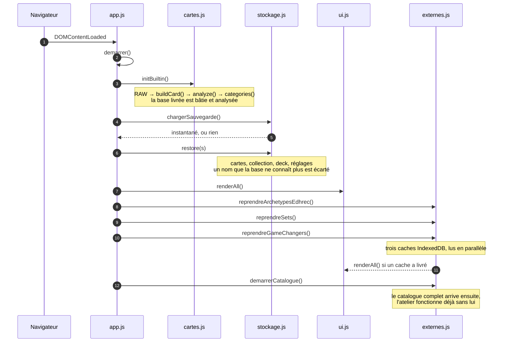

L'application est utilisable avant que le réseau ait répondu : la base intégrée suffit, et chaque
source extérieure ne provoque un nouveau rendu que si elle apporte quelque chose.

### 3.2 Ajouter une carte des suggestions au deck

Le parcours le plus coûteux de l'atelier : le deck change, donc tout le classement des suggestions
qui en dépend doit être refait.

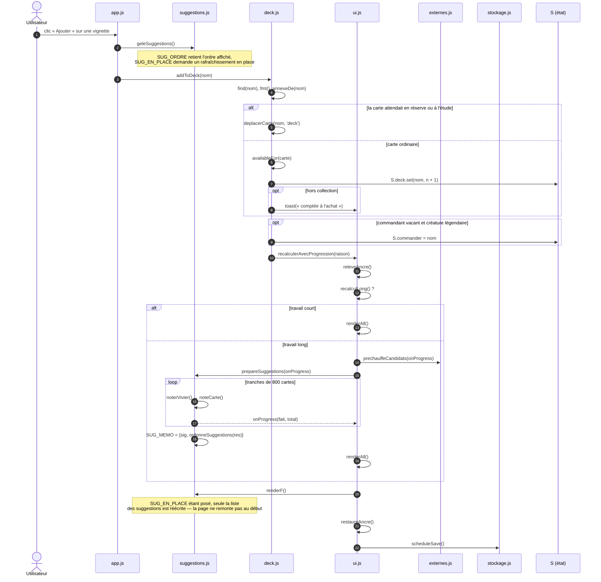

Trois précautions que le diagramme rend visibles :

- **Le gel** est posé *avant* l'ajout, non après : c'est le classement affiché qu'il faut retenir,
  pas celui qui sortira de la notation.
- **L'ancre** est relevée avant tout rendu, et restaurée après : sans elle, la vignette qu'on
  regardait descendrait de quelques centaines de pixels.
- **La notation** ne repart que si l'empreinte a changé (§4). Ajouter une carte la change toujours
  — le deck fait partie de l'empreinte.

### 3.3 Retirer une carte du deck

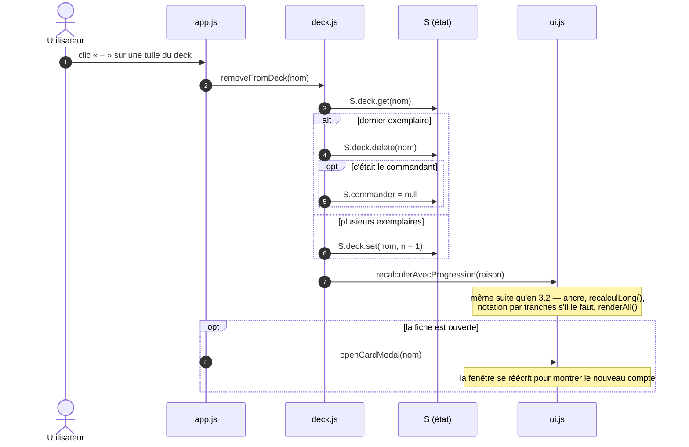

Le retrait n'est pas le symétrique exact de l'ajout : il ne gèle pas l'ordre des suggestions. Le
geste part d'une tuile du deck, non d'une vignette de la section F ; il n'y a pas de place à
perdre dans une liste qu'on ne parcourait pas.

### 3.4 Filtrer

Le seul parcours à deux temps : la fenêtre travaille sur un brouillon, et rien ne s'applique avant
« Appliquer ».

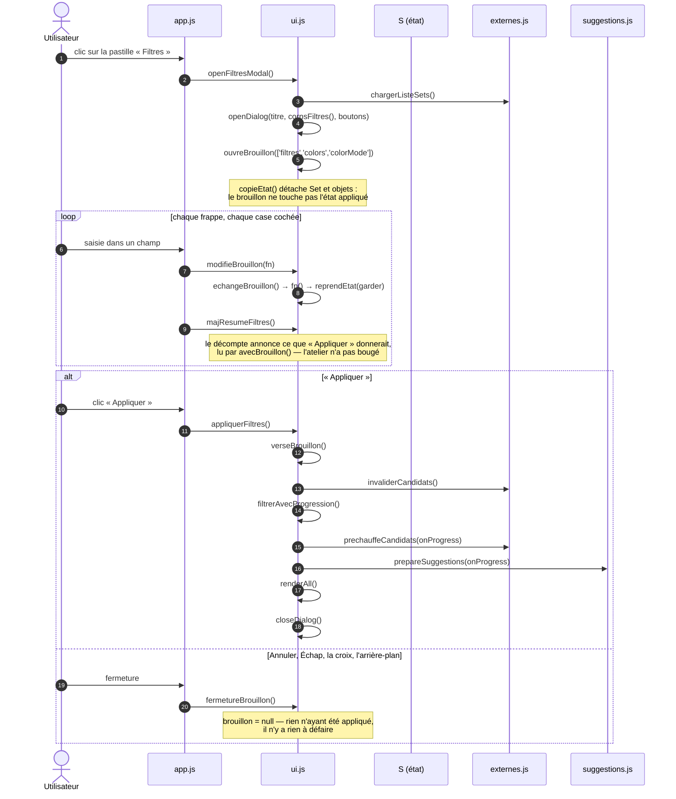

Un filtre appliqué hors fenêtre — une couleur cliquée dans l'en-tête, un rôle basculé — passe par
`apresReglage(raison)` (`js/ui.js`), qui dégèle les suggestions, invalide les candidates et
appelle le même recalcul. C'est le point commun de tous les réglages : **un filtre change le
vivier, donc tout le classement.**

### 3.5 Noter les suggestions

Le moteur appelé par les parcours précédents, vu de près.

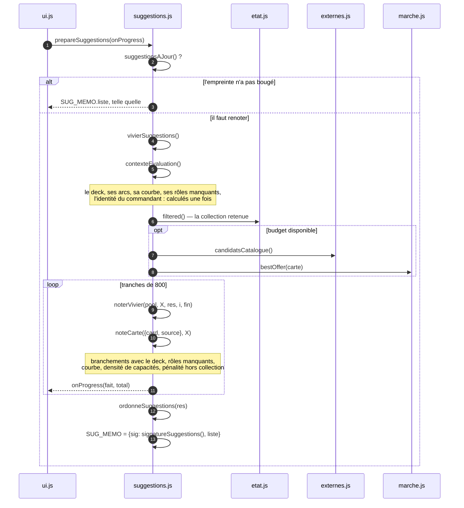

### 3.6 Grouper et trier

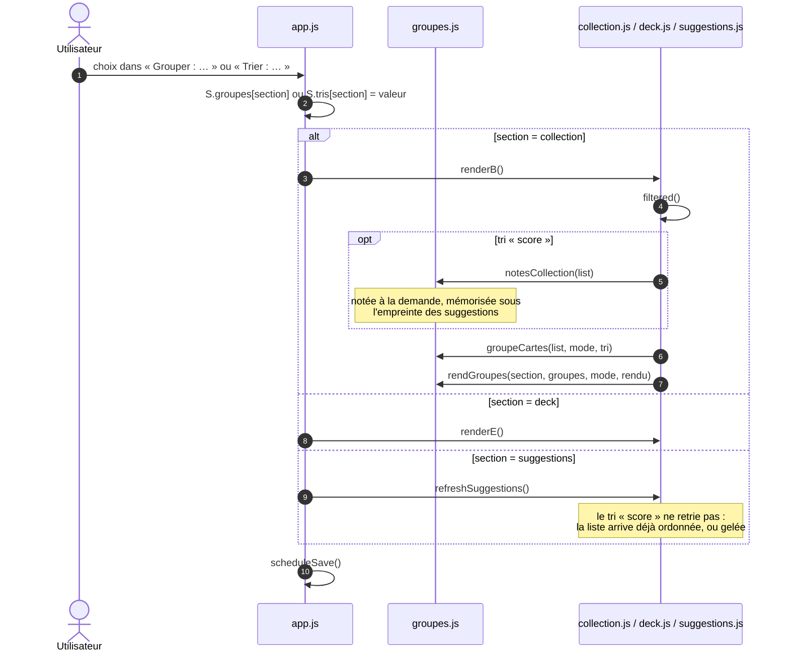

### 3.7 Replier une catégorie

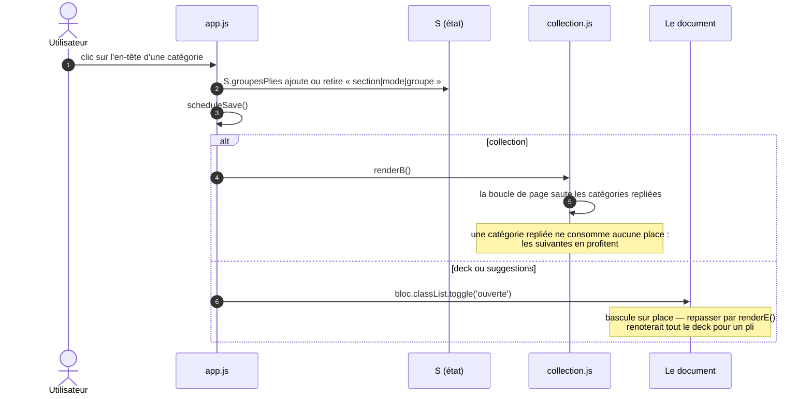

### 3.8 Importer une liste MTGO

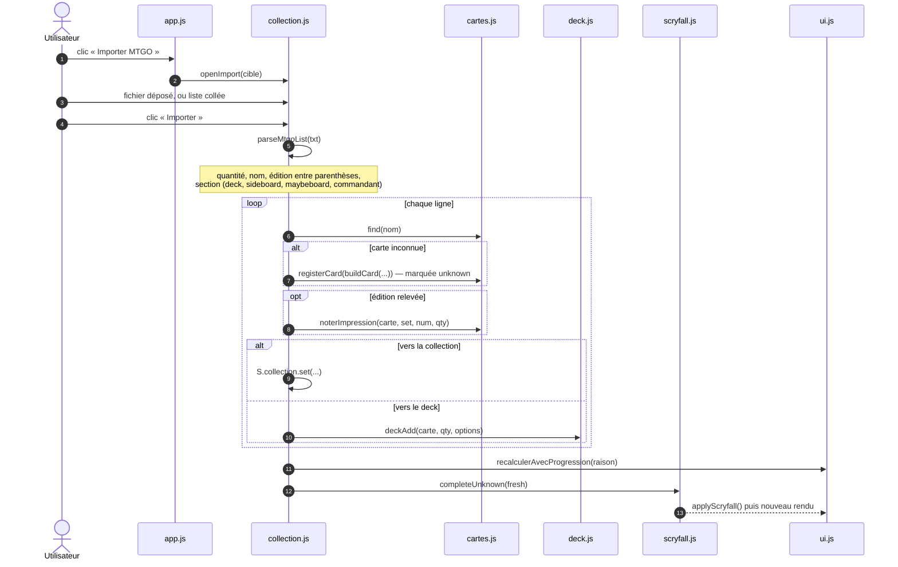

### 3.9 Désigner un commandant

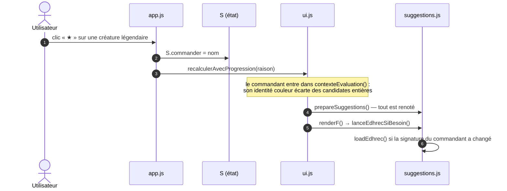

### 3.10 Enrichir par Scryfall

Le seul parcours que l'utilisateur ne déclenche pas : il part du rendu lui-même.

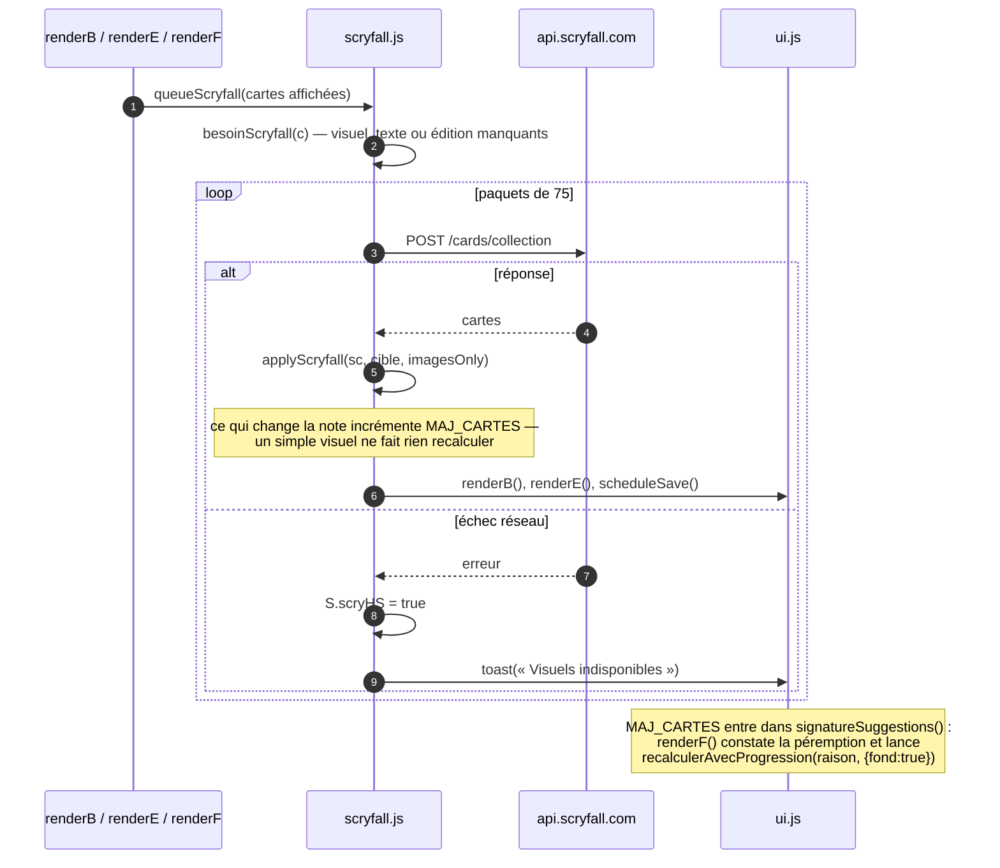

Le recalcul de fond ne montre pas de boîte : il gèle l'ordre affiché, avance par tranches et
signale son travail par le liseré de la section. Une carte complétée pendant qu'on lit ne doit pas
interrompre la lecture.

### 3.11 EDHREC et Commander Spellbook

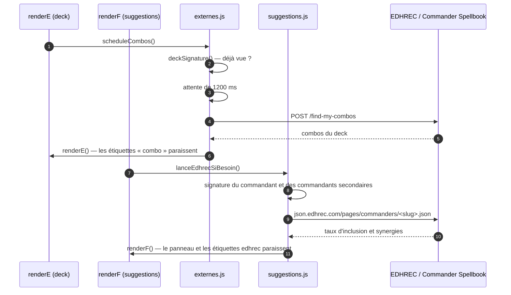

Les deux sources sont attendues, jamais bloquantes : une signature les empêche de repartir pour un
deck inchangé, et leur absence ne retire rien au classement, qui repose d'abord sur l'analyse des
textes.

### 3.12 Acheter sur Cardmarket

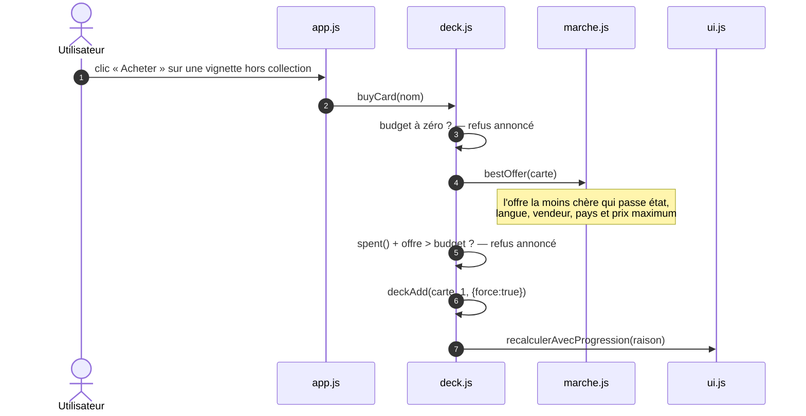

### 3.13 Sauvegarder

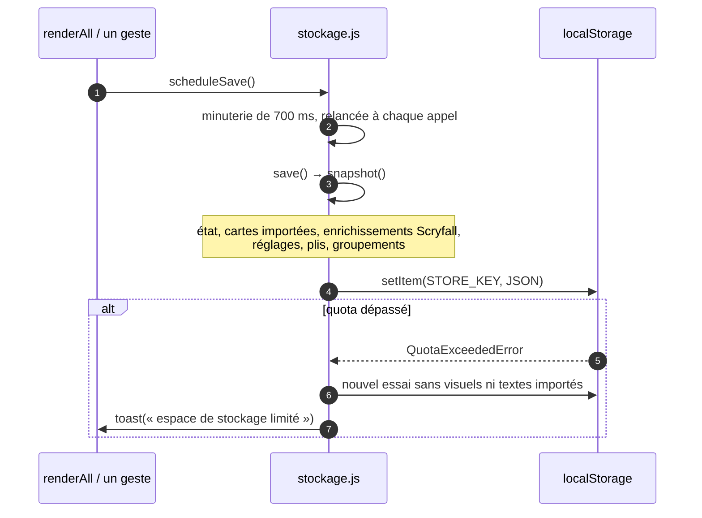

---

## 4. Ce qui périme quoi

Un même clic coûte parfois rien, parfois la notation de vingt mille cartes. Trois mémos l'expliquent,
chacun gardé sous une empreinte : tant que l'empreinte est la même, le travail n'est pas refait.

| Mémo | Ce qu'il garde | Son empreinte | Ce qui la change |
|---|---|---|---|
| `CAND` (`js/externes.js`) | Le vivier tiré du catalogue | `signatureCandidats()` | Format, couleurs, filtres, prix maximum, plafond des candidates, légalité, effets isolés |
| `SUG_MEMO` (`js/suggestions.js`) | La sélection notée et ordonnée | `signatureSuggestions()` | L'empreinte des candidates, **le deck et son commandant**, la collection, le budget, `MAJ_CARTES`, les données EDHREC et combos |
| `NOTES_COLLECTION` (`js/groupes.js`) | Les notes de la collection, pour le tri par score | `signatureSuggestions()` | Les mêmes |

Deux conséquences pratiques :

- **Ajouter ou retirer une carte du deck renote tout.** Le deck fait partie de l'empreinte des
  suggestions ; il n'y a pas de renotation partielle. C'est pourquoi ces gestes passent par le
  recalcul à tranches plutôt que par un rendu direct.
- **Replier, grouper, trier ne renotent rien.** Ces gestes ne touchent aucune empreinte : ils
  redessinent, et rien de plus. Seul le premier tri par score de la collection paie une notation,
  une fois.

`invaliderCandidats()` (`js/externes.js`) vide le premier mémo à la main, quand un réglage
change le vivier sans que l'empreinte suffise à le dire. `apresReglage()` l'appelle pour tout
réglage venu d'une fenêtre, et `degeleSuggestions()` lève au passage l'ordre gelé : un nouveau
filtre demande une autre liste, pas l'ancienne dans son ancien ordre.
